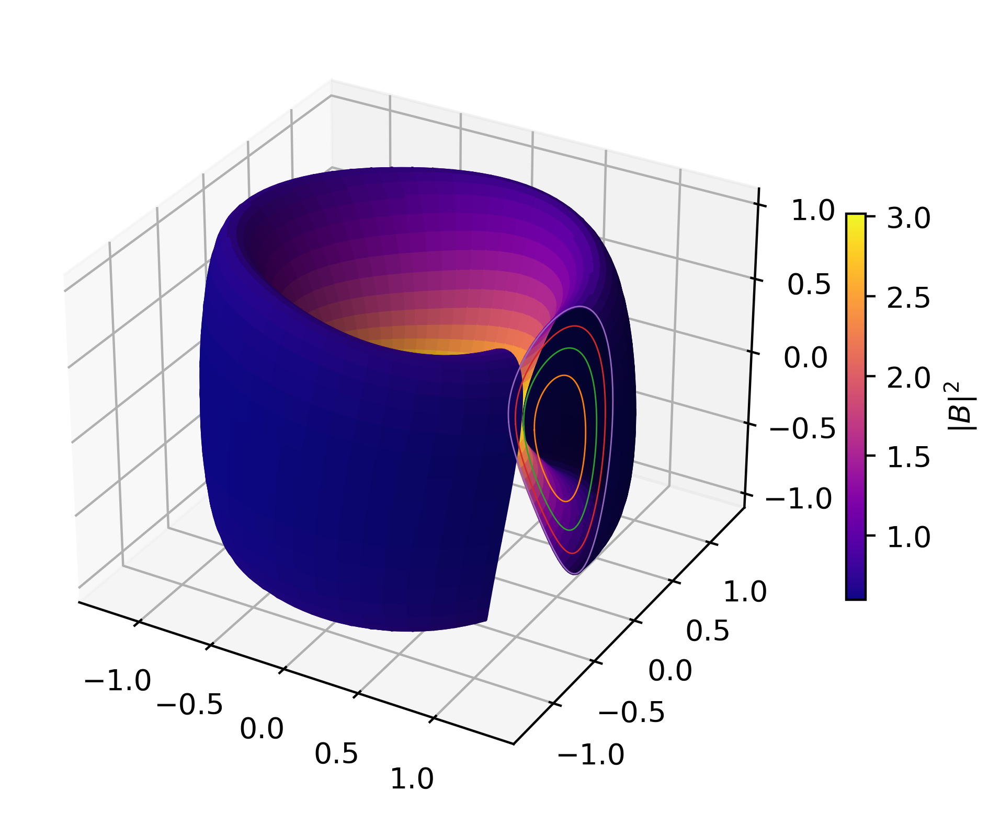

# pyAQSC
Welcome to pyAQSC documentations!



PyAQSC directly constructs globally quasi-symmetric, anisotropic stellarator equilibria without costly optimization using the method of near-axis expansion (NAE). The construction procedure is GPU accelerated and fully auto-differentiable.

PyAQSC is the first NAE code incorporating pressure anisotropy. It can explore new design spaces for equilibria with good quasisymmetry and small pressure anisotropy. It can also model higher order ($n\geq3$) physical quanties unavailable to scalar-pressure NAE (such as magnetic shear $\iota$) without special parameter choices.

For an intriduction on near-axis expansion and the formulation behind pyAQSC, see [backgrounds](background.md).

For a quick example, see [quick start](quick-start.md).

## Installation and dependencies
pyAQSC requires only Numpy, Matplotlib, and JAX. To install a JAX version matching your hardware, see the official [JAX installation guide](https://jax.readthedocs.io/en/latest/installation.html).

After installing JAX, install pyAQSC by:

```
pip install aqsc
```

Some unit tests uses Matt Landreman's [pyQSC](https://github.com/landreman/pyQSC). The code does not require pyQSC to function. PyQSC import is disabled by default, and can be enabled in `config.py` when needed.

Notebooks in `MHD_recursion_relations/` and `magnetic_recursion_relations/` requires [wxMaxima](https://wxmaxima-developers.github.io/wxmaxima/) to view. The notebooks are not required to
run pyAQSC, but contains source expressions that pyAQSC evaluates.

## Importing
To use pyAQSC, simply run

    import aqsc

## Contact
Please contact [Lanke Fu](mailto:ffu@pppl.gov) at PPPL for questions and bug reports.

## References
1. [Weakly Quasisymmetric Near-Axis Solutions to all Orders](https://doi.org/10.1063/5.0076583)
2. [Solving the problem of overdetermination of quasisymmetric equilibrium solutions by near-axis expansions. I. Generalized force balance](https://doi.org/10.1063/5.0027574)
3. [Solving the problem of overdetermination of quasisymmetric equilibrium solutions by near-axis expansions. II. Circular axis stellarator solutions](https://aip.scitation.org/doi/10.1063/5.0027575)
4. [pyQSC](https://github.com/landreman/pyQSC)

5. [Direct construction of optimized stellarator shapes. Part 1. Theory in cylindrical coordinates](https://doi.org/10.1017/S0022377818001289)
6. [Optimized quasisymmetric stellarators are consistent with the Garren–Boozer construction](https://iopscience.iop.org/article/10.1088/1361-6587/ab19f6)