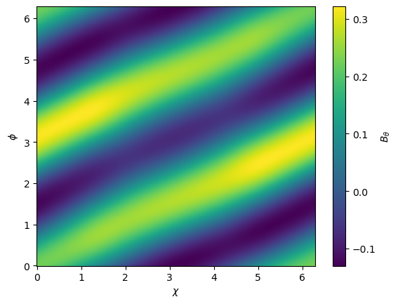
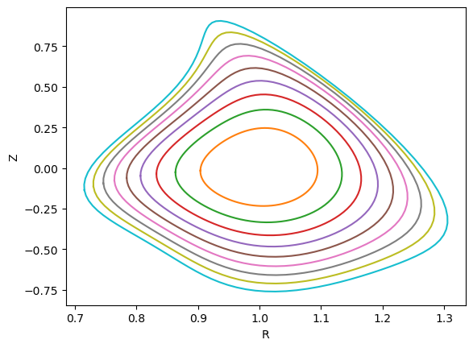

# Results and plotting
All data within an `Equilibrium` are within 3 dictionaries: `aqsc.Equilibrium.unknown`, `aqsc.Equilibrium.constant` and `aqsc.Equilibrium.axis_info`. See [Equilibrium API](api-equilibrium.md) for their contents. In addition, the equilibrium's helicity can be obtained using `aqsc.Equilibrium.get_helicity()`.
```
import aqsc
import numpy as np

equilibrium_circ = aqsc.circular_axis()
print(equilibrium_circ.unknown.keys())
print(equilibrium_circ.constant.keys())
print(equilibrium_circ.axis_info.keys())
print('Helicity is', equilibrium_circ.get_helicity())
# Continued below
```
All constituents of `aqsc.Equilibrium.unknown` and `aqsc.Equilibrium.constant` are `ChiPhiEpsFunc`'s and `ChiPhiFunc`'s. To evaluate them at a given flux coordinate, use `eval`.
```
# Continuing above
import matplotlib.pyplot as plt
psi = 0.05
chi = np.linspace(0, 2*np.pi, 500)
phi = np.linspace(0, 2*np.pi, 500)
# B_theta on a flux surface
B_theta_on_surface = \
    equilibrium_circ.unknown['B_theta_coef_cp'].eval(psi,chi[:,None], phi[None, :])
# Make colormap
plt.pcolor(chi, phi, np.real(B_theta_on_surface))
plt.xlabel('$\chi$')
plt.ylabel('$\phi$')
plt.colorbar(label=r'$B_\theta$')
plt.show()
# Continued below
```


To transform the flux coordinate of an `Equilibrium` into Frenet, cylindrical or xyz coordinates, use `aqsc.Equilibrium.flux_to_frenet`
```
# Continuing above
# Plots some flux surfaces
phi = jnp.linspace(0, np.pi*2, 100)
for psi_i in jnp.linspace(0, 0.1, 10):
    R, _, Z = equilibrium_circ.flux_to_cylindrical(psi_i, phi, 0.6)
    plt.plot(R,Z)
plt.xlabel('R')
plt.ylabel('Z')
plt.show()
# Continued below
```


An order of an `Equilibrium` can be plotted with `aqsc.Equilibrium.display_order(n)`. See [Equilibrium API](api-equilibrium.md) for its usage.

A `ChiPhiFunc` can be plotted with `aqsc.ChiPhiFunc.display()` and `aqsc.ChiPhiFunc.display_content()`. See [ChiPhiFunc API](api-chiphifunc.md) for their usage.


Two `ChiPhiFunc`'s can be compared with `aqsc.compare_chiphifunc()`. See [utility API](api-utils.md) for its usage.